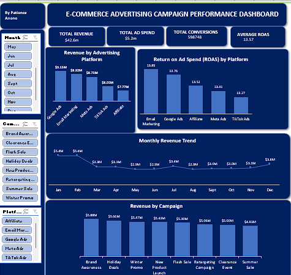

# 📊 E-Commerce Advertising Campaign Performance Analysis

**Author:** Patience Anono  
**Role:** Data Analyst | Data Consultant  
**Tools Used:** Microsoft Excel, Pivot Tables, Dashboard Design

---

## 📌 Project Overview

This project analyzes the performance of advertising campaigns for an e-commerce business across multiple marketing platforms including **Google Ads, Meta Ads, TikTok Ads, Email Marketing and Affiliate Marketing**.

The goal of this analysis was to evaluate campaign effectiveness, understand revenue contribution by platform, measure marketing efficiency and provide insights that can help optimize advertising strategies.

Using Excel, the dataset was cleaned and transformed, key marketing metrics were calculated, pivot tables were created for analysis and an interactive dashboard was built to visualize campaign performance.

---

## 🗂 Dataset Description

The dataset contains advertising campaign performance data with the following fields:

- Campaign_ID  
- Campaign_Name  
- Platform  
- Date  
- Impressions  
- Clicks  
- Conversions  
- Ad_Spend  
- Revenue  
- CTR  
- Conversion_Rate  
- CPA  
- ROAS  
- Year  
- Month  
- Month_Number  

These variables allow for time-based analysis and marketing performance evaluation.

---

## 📈 Key Marketing Metrics

The following marketing performance metrics were calculated in Excel:

**CTR (Click-Through Rate)**  
CTR = Clicks / Impressions  

**Conversion Rate**  
Conversion Rate = Conversions / Clicks  

**CPA (Cost Per Acquisition)**  
CPA = Ad Spend / Conversions  

**ROAS (Return on Ad Spend)**  
ROAS = Revenue / Ad Spend  

These metrics are widely used to measure advertising performance and marketing efficiency.

---

## 📊 Dashboard

The dashboard provides a visual summary of campaign performance and includes:

- KPI cards for Total Revenue, Total Ad Spend, Total Conversions, and Average ROAS
- Revenue comparison by advertising platform
- Return on Ad Spend (ROAS) by platform
- Monthly revenue trend analysis
- Revenue contribution by campaign

---

## 🔎 Key Insights

The analysis revealed several important insights:

- **Google Ads generated the highest overall revenue** among all advertising platforms.
- **Email Marketing delivered the strongest ROAS**, making it the most efficient marketing channel.
- **Meta Ads showed consistent revenue contribution** across campaigns.
- **TikTok Ads had relatively lower ROAS**, indicating potential opportunities for campaign optimization.
- Promotional campaigns such as **Holiday Deals and Flash Sale** performed particularly well.

---

## 💡 Strategic Recommendations

Based on the analysis, the following actions are recommended:

- Increase investment in **high-ROAS channels such as Email Marketing**
- Optimize campaigns on **TikTok Ads and Affiliate Marketing**
- Leverage **seasonal and promotional campaigns** to maximize revenue
- Continuously monitor **CTR, Conversion Rate, CPA and ROAS** to improve marketing efficiency

---

## 📁 Repository Contents

This repository contains:

- `ecommerce_ad_campaign_dashboard.xlsx` – Excel dashboard and pivot analysis  
- `ecommerce_ad_campaign_dataset.csv` – Campaign dataset used for analysis  
- `ecommerce_ad_campaign_report.pdf` – Stakeholder summary report  
- `dashboard_preview.png` – Dashboard screenshot  
- `README.md` – Project documentation  

---

## 🎯 Business Value

This project demonstrates how marketing campaign data can be transformed into **actionable insights through data analysis and dashboard reporting**.

The dashboard helps stakeholders quickly evaluate campaign performance, compare marketing channels and support **data-driven marketing decisions**.
